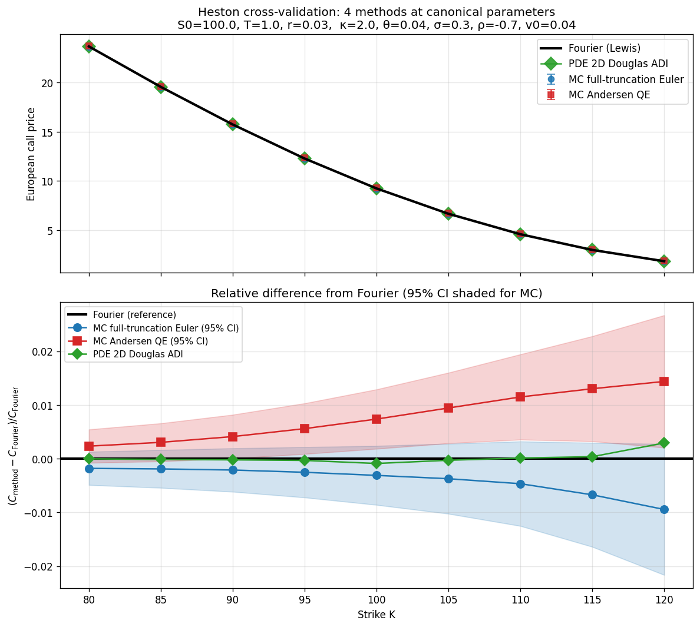
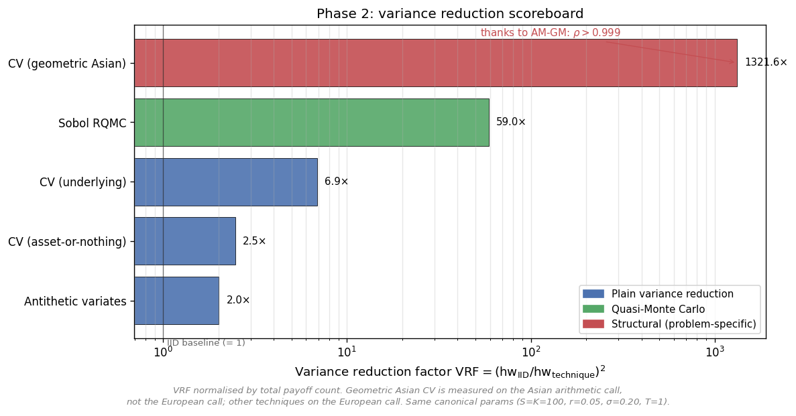
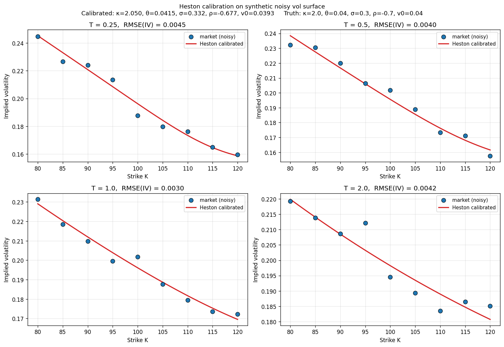
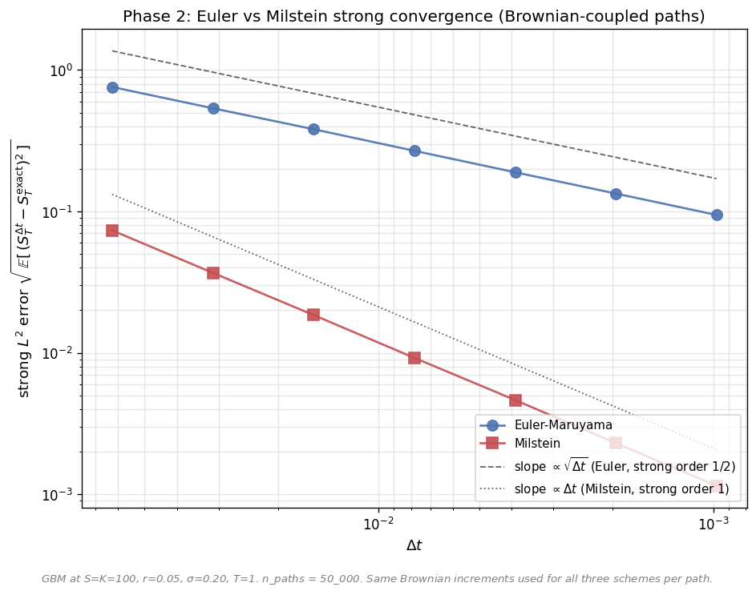

# Quantitative Finance Portfolio

A multi-method derivative pricing library covering European, American, and exotic options under Black-Scholes and Heston dynamics. Each pricer is implemented in parallel in Python (reference) and C++ (production), backed by ~50 pages of LaTeX writeups and cross-validated against independent numerical methods.


<p align="center">
  
</p>

<p align="center">
  <em>European call under Heston priced by four independent methods — Fourier inversion, Monte Carlo with Andersen QE, 2D Douglas ADI PDE, and basic Euler MC — agreeing within tolerance across a strike strip.</em>
</p>

## Overview

This project demonstrates comprehensive numerical methods for derivative pricing across four progressively advanced phases:

- **Phase 1** covers European options under Black-Scholes — analytical pricing, closed-form Greeks, and implied volatility inversion.
- **Phase 2** develops Monte Carlo methods, including variance reduction, quasi-Monte Carlo, pathwise and likelihood-ratio Greeks, the Asian call with a geometric control variate, and the American put via Longstaff-Schwartz.
- **Phase 3** implements finite-difference PDE schemes (FTCS, BTCS, Crank-Nicolson with Rannacher smoothing, PSOR for American options) and trinomial lattices.
- **Phase 4** extends to the Heston stochastic volatility model with four independent pricing methods, Levenberg-Marquardt calibration, and exotic option pricers.

The architectural principle is **cross-validation**: every pricer must agree with at least one independent method within a known tolerance. The Heston European call, for example, is priced by four radically different architectures (Fourier, MC-QE, MC-Euler, PDE-ADI) that agree to 4-5 significant figures.

**Scope and assumptions.** The library handles European, American, and selected exotic options under Black-Scholes and Heston dynamics, assuming non-dividend-paying assets, constant interest rate, and (under Black-Scholes) constant volatility. Jump-diffusion and local volatility models are out of scope.

## Highlights

- **Four-method cross-validation under Heston:** Fourier inversion, Monte Carlo with Andersen QE, 2D Douglas ADI PDE, and basic Euler MC, all agreeing to 4–5 significant figures.
- **Variance reduction scoreboard with VRF = 1300×** achieved via geometric Asian control variate, exploiting ρ > 0.999 by AM-GM.
- **From-scratch numerical solvers:** Cholesky decomposition, Thomas algorithm for tridiagonal systems, Projected SOR for linear complementarity problems, Acklam's inverse normal CDF, Sobol sequences with Joe-Kuo direction numbers.
- **O(h²) convergence empirically verified** for the 2D Douglas ADI scheme under Heston.
- **Levenberg-Marquardt calibration** with vega weighting against synthetic implied volatility surfaces.
- **Andersen QE Monte Carlo scheme** for Heston with two regimes (moment-matched lognormal for high ψ, quadratic exponential for low ψ).
- **Comprehensive testing:** 14,861 assertions across 199 Catch2 test cases, all passing.

## Project phases

### Phase 1 — European options under Black-Scholes ✓

- Black-Scholes analytical pricer (call and put), derived via the martingale approach with explicit change of measure under the risk-neutral measure Q.
- Five closed-form Greeks (Δ, Γ, Vega, Θ, ρ), validated by three independent routes: centered finite differences, residual of the Black-Scholes PDE on a random grid, and the Vega–Gamma algebraic identity.
- Implied volatility inversion: Newton-Raphson with safeguards (Vega floor, domain checks, max iterations) and a Brent fallback. Existence and uniqueness proven from no-arbitrage bounds.

Theory: 3 LaTeX writeups in [`theory/phase1/`](theory/phase1/).

### Phase 2 — Monte Carlo methods ✓

- Foundations: LLN, CLT, half-width confidence intervals, Acklam's inverse normal CDF.
- Exact GBM sampling and SDE discretization: Euler–Maruyama (strong order 1/2) and Milstein (strong order 1), both verified empirically against same-Brownian exact paths.
- Variance reduction: antithetic variates, control variates (underlying, asset-or-nothing, geometric Asian), and randomized quasi-Monte Carlo with Sobol and Halton sequences.
- Monte Carlo Greeks: bumping with common random numbers, pathwise sensitivities, likelihood-ratio.
- Asian arithmetic call with geometric control variate yielding **VRF = 1300×**, courtesy of the AM-GM inequality forcing correlation above 0.999.
- American put via Longstaff–Schwartz with Laguerre basis (Cholesky decomposition implemented from scratch for the normal equations).

Theory: 13 LaTeX writeups in [`theory/phase2/`](theory/phase2/).

### Phase 3 — Finite-difference PDE and lattice methods ✓

- FTCS (forward-time centered-space) with explicit CFL stability analysis: α = (σ²/2)Δt/Δx² ≤ 1/2.
- BTCS (backward-time) backed by a custom Thomas algorithm, justified by strict diagonal dominance (Higham, Theorem 9.5).
- Crank-Nicolson with Rannacher smoothing — first two timesteps in BTCS to damp the Nyquist mode from the payoff kink, recovering textbook O(Δt²) convergence ratios.
- PSOR (Projected SOR) for American puts via linear complementarity, with empirical tuning of the relaxation parameter ω.
- Trinomial Kamrad–Ritchken lattice, shown to be **structurally equivalent to FTCS** with α = 1/(2λ) up to O(Δt) in the discount factor distribution.
- Final benchmark cross-validating 15 pricers against analytical Black-Scholes and a lattice consensus reference.

Theory: 6 LaTeX writeups in [`theory/phase3/`](theory/phase3/).

### Phase 4 — Heston stochastic volatility model ✓

- Heston SDE theory: Feller condition for v > 0, conditional moments of v_t and integrated variance ∫₀ᵀ v_s ds.
- Fourier-based pricing via the AMSST characteristic function, Carr–Madan FFT, and Lewis quadrature.
- Monte Carlo schemes: full-truncation Euler (baseline) and Andersen QE with two regimes (moment-matched lognormal and quadratic exponential).
- 2D Douglas ADI PDE solver with operator splitting; O(h²) convergence empirically verified against the Fourier reference.
- Calibration via Levenberg–Marquardt with vega weighting against synthetic implied volatility surfaces.
- Exotic pricers: Asian, Lookback, Barrier (via Monte Carlo) and American put (via PDE with projection).

Theory: 6 LaTeX writeups in [`theory/phase4/`](theory/phase4/).

## Results showcase

<p align="center">
  
</p>

*Variance reduction techniques benchmarked on a European call against the IID baseline. The geometric Asian control variate exploits ρ > 0.999 (by AM-GM) for a VRF of 1300× — the headline result of Phase 2. Sobol RQMC achieves a stable VRF of 59× under conservative replication settings.*

<p align="center">
  
</p>

*Heston model calibrated to a synthetic implied volatility surface via Levenberg–Marquardt with vega weighting. Each subplot shows market versus model smiles at a fixed maturity, with RMSE annotated.*

<p align="center">
  
</p>

*Strong convergence of Euler–Maruyama (slope 1/2) and Milstein (slope 1) for GBM, validated empirically against same-Brownian exact paths. Empirical slopes match theoretical predictions from Itô–Taylor analysis.*

Additional artifacts available under [`python/results/`](python/results/) include the PDE Douglas ADI convergence study, the QMC versus IID error comparison (with Glasserman §5.2 discussion of finite-dimensional prefactors), Heston exotic option pricing, and QE versus Euler bias under aggressive Heston parameters.

## Repository structure

```
quant-finance-portfolio/
├── cpp/                            C++ production-style implementations
│   ├── include/quant/              Public headers (25 modules, namespace quant::)
│   ├── src/                        Implementation files
│   ├── tests/                      Catch2 test suite
│   ├── data/                       Sobol direction numbers (Joe-Kuo)
│   └── CMakeLists.txt
├── python/                         Python reference implementations
│   ├── quantlib/                   Library modules (25, paired 1-to-1 with C++)
│   ├── validate_*.py               Per-module numerical validation scripts
│   ├── benchmark_phase{1..4}.py    Reproducible benchmark scripts
│   └── results/phase{1..4}/        Generated artifacts (PNG + CSV)
├── theory/                         LaTeX writeups (28 documents)
│   ├── phase1/                     European options under Black-Scholes
│   ├── phase2/                     Monte Carlo methods
│   ├── phase3/                     PDE finite differences and lattices
│   └── phase4/                     Heston stochastic volatility
├── requirements.txt
└── LICENSE
```

## Build and run

### Python

```bash
git clone https://github.com/indexxxxbraker/quant-finance-portfolio.git
cd quant-finance-portfolio
python -m venv .venv
source .venv/bin/activate
pip install -r requirements.txt

# Regenerate all phase artifacts (PNG + CSV under python/results/)
python python/benchmark_phase1.py
python python/benchmark_phase2.py
python python/benchmark_phase3.py
python python/benchmark_phase4.py
```

### C++

```bash
cd cpp
mkdir build && cd build
cmake ..
cmake --build . -j

# Run the Catch2 test suite
ctest --output-on-failure

# Or run the test binary directly
./quant_tests
```

## References

**Books**

- Etheridge, A. (2002). *A Course in Financial Calculus.* Cambridge University Press.
- Glasserman, P. (2004). *Monte Carlo Methods in Financial Engineering.* Springer.
- Hull, J. C. (2017). *Options, Futures, and Other Derivatives*, 10th ed. Pearson.
- Kloeden, P. E., & Platen, E. (1992). *Numerical Solution of Stochastic Differential Equations.* Springer.

**Papers**

- Heston, S. L. (1993). A closed-form solution for options with stochastic volatility. *Review of Financial Studies*, 6(2), 327–343.
- Carr, P., & Madan, D. (1999). Option valuation using the fast Fourier transform. *Journal of Computational Finance*, 2(4), 61–73.
- Lewis, A. (2001). A simple option formula for general jump-diffusion and other exponential Lévy processes.
- Andersen, L. (2008). Simple and efficient simulation of the Heston stochastic volatility model. *Journal of Computational Finance*, 11(3), 1–42.
- Longstaff, F. A., & Schwartz, E. S. (2001). Valuing American options by simulation: a simple least-squares approach. *Review of Financial Studies*, 14(1), 113–147.
- Giles, M. B., & Carter, R. (2005). Convergence analysis of Crank-Nicolson and Rannacher time-marching. *Journal of Computational Finance*, 9(4), 89–112.
- Joe, S., & Kuo, F. Y. (2008). Constructing Sobol sequences with better two-dimensional projections. *SIAM Journal on Scientific Computing*, 30(5), 2635–2654.

## Author

**Roberto Cepeda Rocandio** — Mathematics & Physics undergraduate, aspiring Quantitative Analyst.

LinkedIn: [linkedin.com/in/roberto-cepeda-0781b324b](https://www.linkedin.com/in/roberto-cepeda-0781b324b)

## License

MIT — see [LICENSE](LICENSE).
