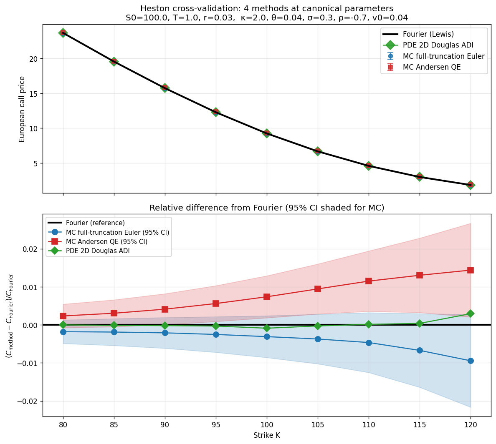
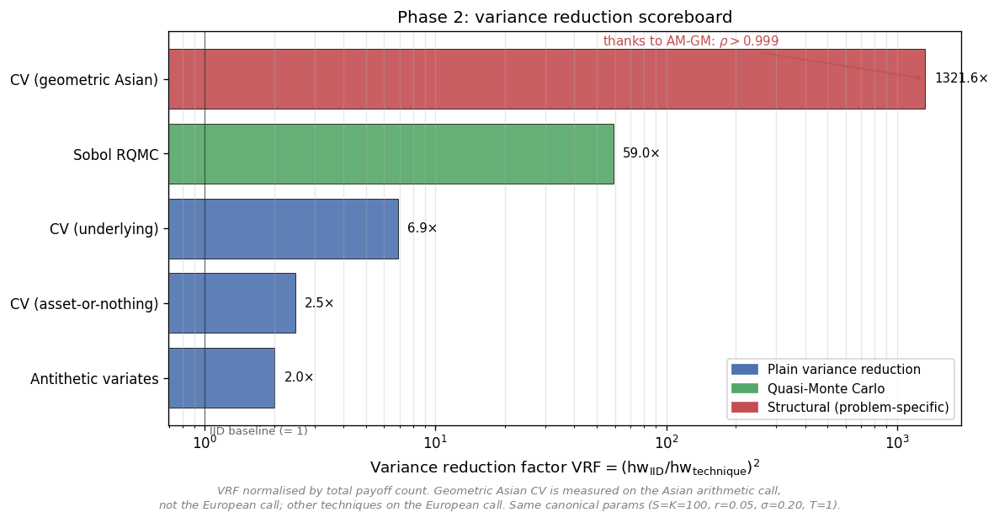
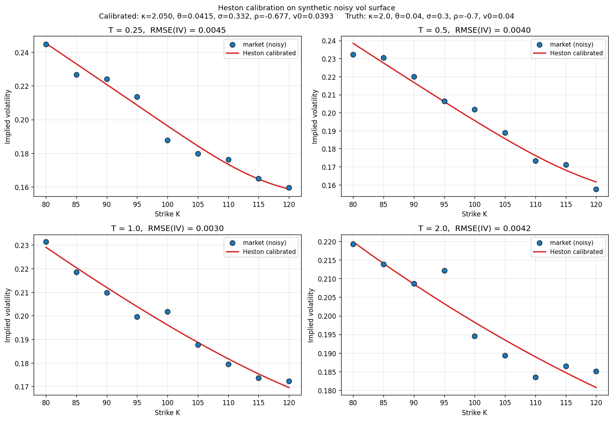
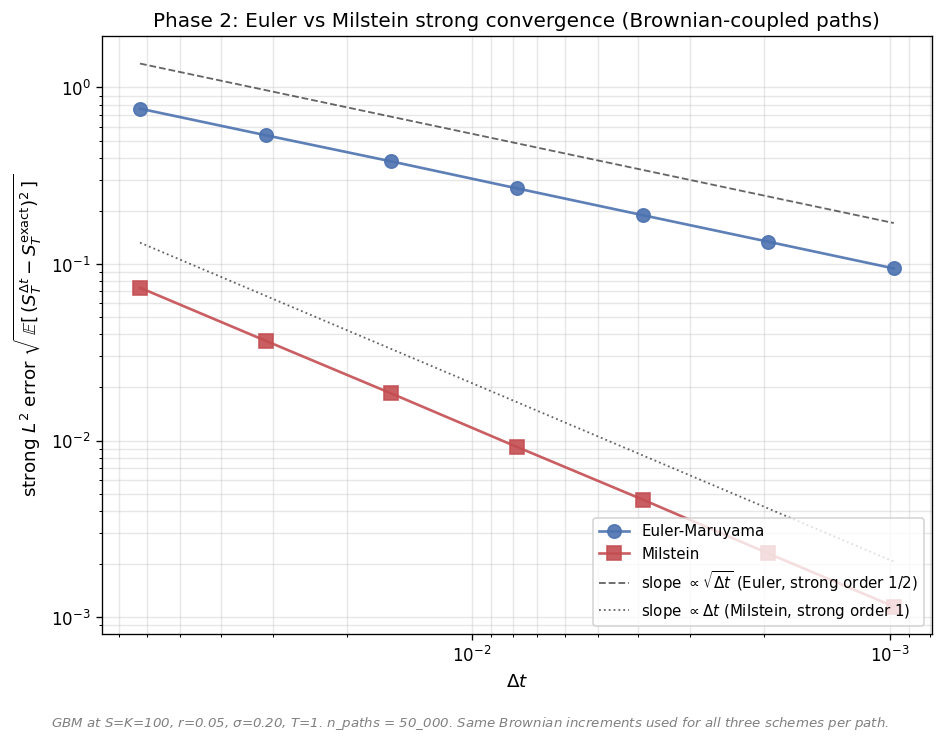

# Quantitative Finance Portfolio

Numerical methods for derivative pricing — analytical, Monte Carlo, finite-difference PDE and Heston stochastic volatility — implemented in Python, ported to C++ with a Catch2 test suite, and written up in LaTeX. Built as a self-directed continuation of my bachelor's thesis.


<p align="center">
  
</p>

<p align="center">
  <em>European call under Heston priced by four independent methods — Fourier inversion, Monte Carlo with Andersen QE, 2D Douglas ADI PDE, and full-truncation Euler Monte Carlo — agreeing within tolerance across a strike strip.</em>
</p>

## About this project

This repository grew out of my bachelor's thesis in Mathematics, [*From the Risk-Neutral Measure to Girsanov's Theorem in Stochastic Integration: Pricing of Financial Products*](https://github.com/indexxxxbraker/option-pricing-via-martingales) (University of Oviedo; defence expected May 2027), which develops the theory of European option pricing from the binomial model up to the Black-Scholes formula. The thesis ends where the numerical questions begin: how do you compute a price when there is no closed form, how do you know that a computed price is right, and what changes once volatility stops being constant.

This project is my attempt to work through those three questions on my own, outside any course. I built it in the spring of 2026, during my Erasmus year in Rome, while I was finishing the thesis and the underlying theory was fresh. It is organised as four phases of increasing difficulty, and every phase follows the same loop: read the theory and write it up in LaTeX, implement it in Python, validate it numerically, then port it to C++ and test it again. The guiding rule throughout is that every pricer must agree with at least one independent method within a stated tolerance.

## How this project was made

I used AI assistants (Anthropic's Claude) throughout, and I would rather say precisely what that means than leave it to the reader to guess. Most of the code and most of the LaTeX were drafted by the assistant from specifications I wrote: which method to implement, which references to follow, which checks it had to pass. The choice of topics and their order, the choice of sources, the review of every derivation, the design of the validation (what each pricer is checked against, and how tightly), the trade-offs along the way (which scheme, which parameters, what to drop) and the debugging were mine. Everything in this repository is something I can explain and defend; if I could not, it would not be here.

## What is in here

- A Heston European call priced four independent ways — Fourier inversion, Andersen QE Monte Carlo, 2D Douglas ADI PDE, and full-truncation Euler Monte Carlo — agreeing to 4–5 significant figures.
- Variance reduction on European and Asian calls, from antithetic variates (VRF ≈ 2) to a geometric-Asian control variate (VRF ≈ 1300, because AM–GM forces ρ > 0.999 between the arithmetic and geometric means).
- Solvers written from scratch rather than imported: Cholesky decomposition, Thomas algorithm, Projected SOR, Acklam's inverse normal CDF, Sobol sequences with Joe–Kuo direction numbers.
- Convergence rates checked against theory: strong order 1/2 vs 1 for Euler–Maruyama vs Milstein, O(Δt²) for Crank–Nicolson with Rannacher smoothing, O(h²) for Douglas ADI.
- Levenberg–Marquardt calibration of Heston with vega weighting, on a synthetic surface.
- 199 Catch2 test cases (14,861 assertions) on the C++ side, mirroring the Python validation scripts.

**Scope and assumptions.** European, American and selected exotic options under Black-Scholes and Heston dynamics, assuming non-dividend-paying assets, a constant interest rate and, under Black-Scholes, constant volatility. Jump-diffusion and local volatility models are out of scope.

## Project phases

### Phase 1 — European options under Black-Scholes

- Black-Scholes analytical pricer (call and put), derived via the martingale approach with explicit change of measure under the risk-neutral measure Q.
- Five closed-form Greeks (Δ, Γ, Vega, Θ, ρ), validated by three independent routes: centered finite differences, residual of the Black-Scholes PDE on a random grid, and the Vega–Gamma algebraic identity.
- Implied volatility inversion: Newton-Raphson with safeguards (Vega floor, domain checks, max iterations) and a Brent fallback. Existence and uniqueness proven from no-arbitrage bounds.

Theory: 3 LaTeX writeups in [`theory/phase1/`](theory/phase1/).

### Phase 2 — Monte Carlo methods

- Foundations: LLN, CLT, half-width confidence intervals, Acklam's inverse normal CDF.
- Exact GBM sampling and SDE discretization: Euler–Maruyama (strong order 1/2) and Milstein (strong order 1), both verified empirically against same-Brownian exact paths.
- Variance reduction: antithetic variates, control variates (underlying, asset-or-nothing, geometric Asian), and randomized quasi-Monte Carlo with Sobol and Halton sequences.
- Monte Carlo Greeks: bumping with common random numbers, pathwise sensitivities, likelihood-ratio.
- Asian arithmetic call with geometric control variate yielding VRF ≈ 1300, because the AM–GM inequality forces correlation above 0.999.
- American put via Longstaff–Schwartz with Laguerre basis (Cholesky decomposition implemented from scratch for the normal equations).

Theory: 13 LaTeX writeups in [`theory/phase2/`](theory/phase2/).

### Phase 3 — Finite-difference PDE and lattice methods

- FTCS (forward-time centered-space) with explicit CFL stability analysis: α = (σ²/2)Δt/Δx² ≤ 1/2.
- BTCS (backward-time) backed by a custom Thomas algorithm, justified by strict diagonal dominance (Higham, Theorem 9.5).
- Crank-Nicolson with Rannacher smoothing — first two timesteps in BTCS to damp the Nyquist mode from the payoff kink, recovering textbook O(Δt²) convergence ratios.
- PSOR (Projected SOR) for American puts via linear complementarity, with empirical tuning of the relaxation parameter ω.
- Trinomial Kamrad–Ritchken lattice, shown to be structurally equivalent to FTCS with α = 1/(2λ) up to O(Δt) in the discount factor distribution.
- Final benchmark cross-validating 15 pricers against analytical Black-Scholes and a lattice consensus reference.

Theory: 6 LaTeX writeups in [`theory/phase3/`](theory/phase3/).

### Phase 4 — Heston stochastic volatility model

- Heston SDE theory: Feller condition for v > 0, conditional moments of v_t and integrated variance ∫₀ᵀ v_s ds.
- Fourier-based pricing via the AMSST characteristic function, Carr–Madan FFT, and Lewis quadrature.
- Monte Carlo schemes: full-truncation Euler (baseline) and Andersen QE with two regimes (moment-matched lognormal and quadratic exponential).
- 2D Douglas ADI PDE solver with operator splitting; O(h²) convergence empirically verified against the Fourier reference.
- Calibration via Levenberg–Marquardt with vega weighting against synthetic implied volatility surfaces.
- Exotic pricers: Asian, Lookback, Barrier (via Monte Carlo) and American put (via PDE with projection).

Theory: 6 LaTeX writeups in [`theory/phase4/`](theory/phase4/).

## Results

<p align="center">
  
</p>

*Variance reduction techniques benchmarked against the IID baseline. The geometric Asian control variate exploits ρ > 0.999 (by AM–GM) for a VRF of about 1300, the largest reduction in the project; it is shown separately because it changes the product being priced, not just the estimator. Sobol RQMC reaches a VRF of about 60 under conservative replication settings.*

<p align="center">
  
</p>

*Heston model calibrated to a synthetic implied volatility surface via Levenberg–Marquardt with vega weighting. Each subplot shows market versus model smiles at a fixed maturity, with RMSE annotated.*

<p align="center">
  
</p>

*Strong convergence of Euler–Maruyama (slope 1/2) and Milstein (slope 1) for GBM, validated empirically against same-Brownian exact paths. Empirical slopes match the Itô–Taylor predictions.*

Further artifacts under [`python/results/`](python/results/) include the Douglas ADI convergence study, the QMC-vs-IID error comparison, Heston exotic prices, and the QE-vs-Euler bias study. Two notebooks under [`notebooks/`](notebooks/) walk through the Heston cross-validation and the variance reduction progression step by step; GitHub renders them with their outputs, so nothing needs to be run to read them.

## Limitations and caveats

- **Model scope.** Non-dividend-paying assets and a constant interest rate throughout; constant volatility under Black-Scholes. No jumps, no local volatility.
- **Calibration data.** The Heston calibrator is exercised on a synthetic implied-volatility surface (Heston-generated, then perturbed), not on market quotes. It has not been tested against real data.
- **QMC convergence rate.** In the QMC-vs-MC study, Sobol RQMC converges empirically like N^-0.62 rather than the asymptotic N^-1: the integrand lives in dimension 20 (Euler with 20 steps), and for N ≤ 2^16 the (log N)^d prefactor has not disappeared (Glasserman, §5.2). The plot keeps the N^-1 reference line rather than hiding it.
- **QE vs Euler regime.** The QE-vs-Euler bias study uses a Feller-violating parameter set (κ = 0.5, σ = 1, ρ = −0.9) that differs from the canonical set used elsewhere. Under canonical parameters the two schemes are within Monte Carlo noise of each other; the aggressive regime is the one QE was designed for, and the change is stated in the plot title, the CSV headers and the script output.
- **C++ performance.** The C++ code is a faithful port of the Python, written while learning the language. It is single-threaded and not tuned for speed.
- **No CI.** Tests are run locally; there is no continuous-integration pipeline.

## What I learned

- Agreement between independent methods is the only test I trust. A pricer can be internally consistent and still be wrong; checking Fourier against ADI against Monte Carlo, which share no code and no approximation, is what made me confident in the Heston numbers.
- Stability conditions matter in practice, not only in the theorems. FTCS with the CFL condition violated produces a sawtooth at the highest grid frequency that grows without bound. Crank–Nicolson does not blow up, but the kink in the payoff excites that same mode and CN only damps it to |g| → 1, so two implicit steps at the start (Rannacher) are needed to recover O(Δt²). The American put under PSOR does not need this, because the projection onto the payoff removes the oscillation.
- In variance reduction, the gain depends on how closely the control matches the structure of the payoff. Antithetic variates give a factor of 2 and a control variate on S_T gives about 7; the geometric-Asian control gives about 1300 because the arithmetic and geometric means of a lognormal path have correlation above 0.999 by AM–GM.
- Asymptotic convergence rates can be far away. Sobol RQMC should converge like N^-1, but in dimension 20 with N ≤ 65,536 the observed rate is N^-0.62 because of the (log N)^d prefactor. This is not an implementation error.
- A better scheme only shows its advantage in the regime it was designed for. With well-behaved Heston parameters, full-truncation Euler and Andersen QE agree within Monte Carlo noise; with the Feller condition strongly violated, Euler's bias is about a hundred times larger.
- Lattices and finite differences are the same construction. The Kamrad–Ritchken trinomial tree with stretch parameter λ is FTCS with α = 1/(2λ), and λ ≥ 1 is the CFL condition.
- Porting from Python to C++ forced me to make explicit what NumPy had been doing implicitly: types, edge cases and the behaviour of library calls. Writing the same algorithm twice was the most effective review of the first version.

## Repository structure

```
quant-finance-portfolio/
├── cpp/                            C++ port of the library
│   ├── include/quant/              Public headers (25 modules, namespace quant::)
│   ├── src/                        Implementation files
│   ├── tests/                      Catch2 test suite
│   ├── data/                       Sobol direction numbers (Joe-Kuo)
│   └── CMakeLists.txt
├── python/                         Python reference implementations
│   ├── quantlib/                   Library modules (25, paired 1-to-1 with C++)
│   ├── validate_*.py               Per-module numerical validation scripts
│   ├── benchmark_phase{1..4}.py    Reproducible benchmark scripts
│   └── results/phase{1..4}/        Generated artifacts (PNG + CSV)
├── notebooks/                      Demo notebooks with rendered outputs
├── theory/                         LaTeX writeups (28 documents)
│   ├── phase1/                     European options under Black-Scholes
│   ├── phase2/                     Monte Carlo methods
│   ├── phase3/                     PDE finite differences and lattices
│   └── phase4/                     Heston stochastic volatility
├── requirements.txt
└── LICENSE
```

## Build and run

### Python

```bash
git clone https://github.com/indexxxxbraker/quant-finance-portfolio.git
cd quant-finance-portfolio
python -m venv .venv
source .venv/bin/activate
pip install -r requirements.txt

# Regenerate all phase artifacts (PNG + CSV under python/results/)
python python/benchmark_phase1.py
python python/benchmark_phase2.py
python python/benchmark_phase3.py
python python/benchmark_phase4.py
```

### C++

```bash
cd cpp
mkdir build && cd build
cmake ..
cmake --build . -j

# Run the Catch2 test suite
ctest --output-on-failure

# Or run the test binary directly
./quant_tests
```

## References

**Books**

- Etheridge, A. (2002). *A Course in Financial Calculus.* Cambridge University Press.
- Glasserman, P. (2004). *Monte Carlo Methods in Financial Engineering.* Springer.
- Hull, J. C. (2017). *Options, Futures, and Other Derivatives*, 10th ed. Pearson.
- Kloeden, P. E., & Platen, E. (1992). *Numerical Solution of Stochastic Differential Equations.* Springer.

**Papers**

- Heston, S. L. (1993). A closed-form solution for options with stochastic volatility. *Review of Financial Studies*, 6(2), 327–343.
- Carr, P., & Madan, D. (1999). Option valuation using the fast Fourier transform. *Journal of Computational Finance*, 2(4), 61–73.
- Lewis, A. (2001). A simple option formula for general jump-diffusion and other exponential Lévy processes.
- Andersen, L. (2008). Simple and efficient simulation of the Heston stochastic volatility model. *Journal of Computational Finance*, 11(3), 1–42.
- Longstaff, F. A., & Schwartz, E. S. (2001). Valuing American options by simulation: a simple least-squares approach. *Review of Financial Studies*, 14(1), 113–147.
- Giles, M. B., & Carter, R. (2005). Convergence analysis of Crank-Nicolson and Rannacher time-marching. *Journal of Computational Finance*, 9(4), 89–112.
- Joe, S., & Kuo, F. Y. (2008). Constructing Sobol sequences with better two-dimensional projections. *SIAM Journal on Scientific Computing*, 30(5), 2635–2654.

## Author

**Roberto Cepeda Rocandio** — Mathematics & Physics undergraduate, University of Oviedo.

LinkedIn: [linkedin.com/in/robertocepedarocandio](https://www.linkedin.com/in/robertocepedarocandio)

## License

MIT — see [LICENSE](LICENSE).
